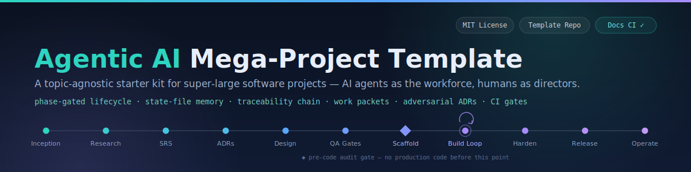

  

# Agentic AI Mega-Project Template

A topic-agnostic starter kit for building **very large software projects with AI agents as the primary workforce and humans as directors**. It was distilled from a real large-scale project run this way, then generalized and enriched with the strongest ideas from community methodologies (GitHub Spec Kit, BMAD, AWS AI-DLC, Cline Memory Bank, Anthropic agentic-coding practices, 12-Factor Agents) and academic research (MetaGPT, ChatDev, the Agentic SE 3.0 roadmap).

## The Core Idea

Large projects fail with AI agents for one reason above all others: **context does not survive**. Sessions end, context windows fill, different agents and models rotate through, and every new session re-derives (or contradicts) what came before.

This template treats the repository itself as the project's brain:

1. **State files** (`docs/CURRENT_TASK.md`, `docs/NEXT_TASK.md`, `docs/CURRENT_THINKING.md`, backlog, risks, debt) make every session resumable by any agent or human.
2. **A phase-gated lifecycle** stops agents from writing production code before requirements, architecture decisions, and quality gates exist.
3. **A traceability chain** (`Requirement → Use Case → Domain Concept → Design → Contract → Test`) makes every line of code justifiable and every regression findable.
4. **Work packets** with owned/forbidden files make agent work bounded, parallelizable, and reviewable.
5. **Short-burst semantic commits with AI attribution** make history readable and revertible.
6. **Adversarial ADRs** force every major decision to survive its strongest counter-argument.
7. **A layered knowledge system** keeps human-readable docs, machine-readable knowledge, and diagrams in sync.

## Quick Start

1. Copy this directory and rename it to your project.
2. Read `GETTING_STARTED.md` and follow the bootstrap steps (replace `{{PLACEHOLDERS}}`, run the Phase 0 kickoff prompt).
3. Point your AI agent at `AGENTS.md` — it defines the contract every agent must follow.
4. Work through the phases in `docs/LIFECYCLE_PHASES.md`. Do not skip gates.

## Directory Map

| Path | Purpose |
|---|---|
| `AGENTS.md` | The agent contract: read order, update order, rules. Every agent reads this first. |
| `CLAUDE.md` | Thin tool-specific entry point (points to `AGENTS.md`). |
| `GETTING_STARTED.md` | How to instantiate this template for a new project. |
| `docs/PROCESS.md` | The always-in-force process rules (prime rule, gates, commits, file sizes). |
| `docs/LIFECYCLE_PHASES.md` | Phase-by-phase playbook with entry/exit criteria. |
| `docs/METHODOLOGY.md` | The software-engineering artifact chain and traceability rule. |
| `docs/AGENT_HANDOFF_SYSTEM.md` | Session start/end protocol, task packets, parallel-agent rules. |
| `docs/MULTI_AGENT_ORCHESTRATION.md` | Agent roles, orchestration patterns, pause points, evidence rules. |
| `docs/CONTEXT_ENGINEERING.md` | Token-safe read order, memory hierarchy, compaction strategy. |
| `docs/KNOWLEDGE_SYSTEM.md` | Docs / machine-knowledge / diagram layers and update rules. |
| `docs/COMMIT_POLICY.md` | Short-burst semantic commits with AI trailers. |
| `docs/GOVERNANCE_AND_GATES.md` | Definition of Ready/Done, phased CI gates, release gates. |
| `docs/RESEARCH_FOUNDATIONS.md` | Annotated sources and which template feature each inspired. |
| `docs/diagrams/` | Canonical Mermaid flowchart pack for the whole process. |
| `docs/CURRENT_TASK.md` etc. | Live state files (the project's working memory). |
| `docs/adr/` | Architecture Decision Records. |
| `docs/software-engineering/` | Artifact skeletons: inception → use cases → domain → design → contracts → report. |
| `docs/qa/` | Test strategy, ready/done, CI gate design, PR checklist. |
| `docs/templates/` | Reusable templates: work packet, ADR, story, handoff, session log, release evidence. |
| `docs/conversation-archive/` | Raw or summarized conversations that changed project direction. |
| `knowledge/okf/` | One-concept-per-file machine-readable knowledge for fast agent ingestion. |
| `tools/qa/` | Generic validators: docs/link/state-file checks, secret scan. |
| `.github/` | PR template, CODEOWNERS placeholder, docs-validation CI workflow. |

## What Makes This Different From "Just Prompting"

| Failure mode of naive AI coding | Countermeasure in this template |
|---|---|
| New session forgets everything | State files + conversation archive + knowledge system |
| Agent builds the wrong thing confidently | Phase gates + purified prompt + spec before code |
| Decisions get silently re-made | ADRs with reversal conditions + decision log |
| Two agents trample each other | Work packets with owned/forbidden files |
| Giant unreviewable diffs | Short-burst semantic commits |
| Tests written after the fact (or never) | Traceability chain + Definition of Ready requires a test plan |
| Quality erodes invisibly | Phased CI gates + file-size guardrails + tech-debt ledger |
| "It works" without proof | Evidence rule: agents must show test output, not assert success |

## License / Attribution

MIT — see `LICENSE`. If you improve the process, record what you changed and why in `docs/RESEARCH_FOUNDATIONS.md` so the methodology itself stays traceable.
