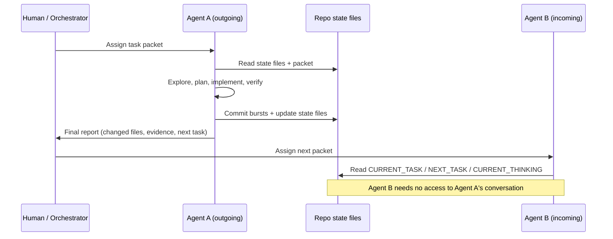

# Agent Handoff System

## Purpose

This project is designed for long-running, multi-agent work. Every agent should be able to understand the current state, pick up one bounded task, and leave a clean trail. Handoff quality is a first-class engineering concern — treat a bad handoff like a failing test.

## Required Read Order (session start)

1. `AGENTS.md`
2. `docs/CURRENT_TASK.md`
3. `docs/NEXT_TASK.md`
4. `docs/CURRENT_THINKING.md`
5. `docs/PROCESS.md`
6. `docs/SRS.md` (skim; deep-read the sections your task touches)
7. Relevant ADRs and work packets
8. Relevant module README
9. Relevant source files

Stop reading as soon as you have enough context for your bounded task — the order exists precisely so you can stop early. See `docs/CONTEXT_ENGINEERING.md` for the token-budget rationale.

## Required Update Order (session end)

1. Update changed artifact docs.
2. Update `docs/TRACEABILITY_MATRIX.md` if requirements/use cases/contracts/tests changed.
3. Update `docs/CURRENT_TASK.md`.
4. Update `docs/NEXT_TASK.md` — the single most important handoff artifact. Write it so a fresh agent with zero conversation history can act on step 1 immediately.
5. Update `docs/CURRENT_THINKING.md`.
6. Update backlog/risk/debt ledgers when needed.
7. Update `docs/conversation-archive/` with raw prompt text or a summary if direction changed.
8. Commit in short semantic bursts with AI trailers.

## Task Packet

Work is handed to agents as packets (full template: `docs/templates/WORK_PACKAGE_TEMPLATE.md`):

```md
## Task

- Work package:
- Goal:
- Requirements:
- Owned files:
- Forbidden files:
- Dependencies:
- Acceptance criteria:
- Test plan:
- Security/privacy notes:
- Rollback:
- Commit plan:
- Handoff notes:
```

A packet should fit one agent session. If it cannot, split it before starting — not midway.

## Handoff Sequence



The test of a good handoff: **Agent B never needs Agent A's chat transcript.**

## AI Final Response Checklist

Every meaningful session ends by stating:

- What changed.
- Files changed.
- Tests or validation run — with pasted evidence.
- What was NOT done.
- The next exact task.
- Commit hashes if commits were created.

## Parallel Agent Rule

Do not let two agents edit the same files in parallel. Split parallel work by owned folders, for example:

- Agent A: `docs/api/`, `packages/contracts/`
- Agent B: `docs/data/`, `infrastructure/database/`
- Agent C: `docs/security/`, `docs/qa/`
- Agent D: application code after its ADR is accepted

Shared files (state docs, traceability matrix) are updated by one designated agent per window, or serialized. See `docs/MULTI_AGENT_ORCHESTRATION.md` for orchestration patterns.

## Interrupted Session Protocol

If a session dies mid-task (context exhausted, crash, user stop):

1. The next agent reads `docs/NEXT_TASK.md` and `git status` / `git log` first.
2. Uncommitted changes are treated as untrusted: re-verify before building on them.
3. If the previous agent left a WIP commit, its message must contain the recovery path; otherwise revert to the last stable commit and re-run the packet.

This is why short-burst commits matter: the blast radius of a dead session is one burst.
