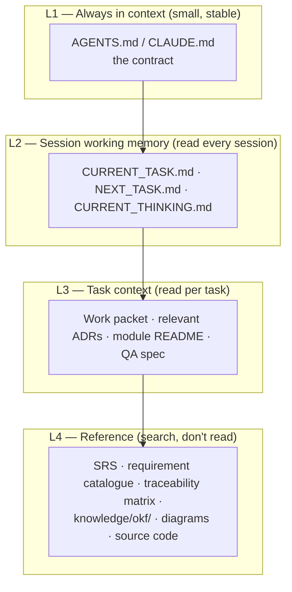

# Context Engineering

The context window is the scarcest resource in agentic development. This document defines how the project spends it. (Sources: Anthropic context-engineering guidance, Cline Memory Bank, 12-Factor Agents — see `docs/RESEARCH_FOUNDATIONS.md`.)

## The Memory Hierarchy

The repository implements a layered memory, from always-loaded to on-demand:

Rules per layer:

- **L1** stays under ~150 lines. It is a table of contents plus hard rules, never a knowledge dump.
- **L2** files are rewritten every session (living documents, not logs — history lives in git).
- **L3** is selected by the work packet. A good packet names exactly which ADRs, specs, and READMEs to read.
- **L4** is navigated with search tools. Never bulk-read reference docs "for context".

## Token-Safe Read Order

When context is limited, read in this order and stop when you can act:

1. `docs/NEXT_TASK.md`
2. `docs/CURRENT_TASK.md`
3. `docs/CURRENT_THINKING.md`
4. The work packet
5. Relevant module README
6. Relevant requirement IDs (search, don't read the whole catalogue)
7. Relevant ADRs
8. Only then: source files

This prevents agents from re-reading the whole repo every session.

## Writing For Machine Readers

Every doc in this repo has two audiences: humans and future agents. Conventions that keep docs agent-efficient:

- **One concept per file** in `knowledge/okf/`; short files with explicit frontmatter.
- **Stable headings** — agents navigate by heading; renaming headings breaks their navigation.
- **IDs everywhere** — `FR-`, `ADR-`, `TC-`, `WP-` tokens are cheap search anchors.
- **Explicit over implied** — "decided X because Y, reversal condition Z" beats narrative prose.
- **No duplicated truth** — link to the owning doc instead of restating it. Duplicated truth diverges, and diverged truth poisons every future session that reads the wrong copy.

## Session Budget Discipline

- Plan the session's reads before reading (the packet tells you what you need).
- Delegate wide exploration (find all usages, survey a directory) to subagents or search tools that return conclusions, not file dumps.
- When a session approaches context exhaustion: stop implementing, commit the current burst, update state files, and end cleanly. A clean early handoff beats a truncated smart one.
- Treat conversation compaction as lossy. Anything that must survive belongs in a file *before* compaction happens — that is the Prime Rule again.

## Anti-Patterns

| Anti-pattern | Why it fails | Instead |
|---|---|---|
| Pasting whole docs into chat | Burns budget; goes stale immediately | Reference paths + IDs |
| One mega CLAUDE.md/AGENTS.md | Low adherence, high cost every session | L1 contract + linked docs |
| Narrating history in state files | State files become archaeology | Rewrite; git keeps history |
| "Read everything first" agents | Session spent before work starts | Token-safe read order |
| Trusting compaction summaries | Silent loss of decisions | Prime Rule: files before compaction |
