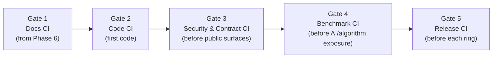

# Governance And Gates

Definitions of Ready/Done, the phased CI gate ladder, and merge/release policy. The QA artifact set lives in `docs/qa/`.

## Definition Of Ready

A task may start coding only when it has:

- requirement IDs or a work-package ID
- owned files/modules
- forbidden files/modules
- acceptance criteria
- test plan
- security/privacy notes
- rollback plan
- expected commit subject(s)
- state-doc update expectation

Ready review questions:

- What behavior is being protected?
- Which requirement proves this work is needed?
- What test would fail if the behavior regresses?
- Could this leak `{{SENSITIVE_DATA_CLASSES}}` or violate a domain invariant?
- How will the next agent know where to continue?

## Definition Of Done

A task is done only when:

- the implementation or documentation change is complete
- required tests/validators pass — with pasted evidence
- skipped tests have an explicit reason and follow-up
- no secrets, sensitive data, or build artifacts are staged
- file-size guardrails are respected or documented as debt
- state docs are updated
- the commit(s) follow `docs/COMMIT_POLICY.md`

Done review questions:

- Can a fresh agent run the same checks and get the same result?
- Are the changed files narrow enough to review?
- Is the next task written before stopping?
- Are discovered bugs, risks, and debt recorded?
- Is each commit small enough to revert independently?

Test closure block for every task closeout:

```txt
Tests Run:
- command:
- result:
- evidence:

Tests Not Run:
- command:
- reason:
- follow-up:

Security/Privacy:
- checked:
- unresolved:
```

## The CI Gate Ladder

CI enforces the same gates agents run locally, and grows with the project. Never install a gate CI-only or local-only — parity is required, and documented.



**Gate 1 — Docs CI (active from day one).** Docs validator (links, required state files, placeholder scan, file-size guardrails, traceability ID presence), secret scan. Workflow: `.github/workflows/docs-validation.yml`.

**Gate 2 — Code CI.** Build + unit tests per module, contract/schema validation, lint/format, import checks.

**Gate 3 — Security & Contract CI.** Dependency audit, public-DTO forbidden-field scan, API spec lint, authz negative tests, idempotency tests, data-scrubbing tests for sensitive classes.

**Gate 4 — Benchmark CI.** Goldset smoke runs for AI/ML or algorithmic features, snapshot tests for core domain state, cost counters. Threshold changes require a report artifact plus a state-doc update — never a silent edit.

**Gate 5 — Release CI.** Release build, signing dry-run (no secrets in repo), crash/telemetry configuration smoke, manual QA checklist link, store/compliance checklist where relevant.

## Merge Policy

- P0 gate failures block merge, always.
- P1 failures block release builds unless a recorded waiver exists (owner + expiry).
- Flaky tests are fixed or quarantined with owner and expiry — never deleted quietly.
- CI config changes must ship with the matching local command documented.

## The Pre-Code Completion Audit

The one-time gate that opens production coding (Phase 5 → 6) has its own artifact: `docs/PRECODE_COMPLETION_AUDIT.md`, built from `docs/templates/PRECODE_AUDIT_TEMPLATE.md`. It is produced by **repeated self-audit passes** — ask "what useful pre-code work remains?", execute what surfaces, re-audit — until a full pass finds nothing new that is not code-dependent. Every status claim cites evidence; validator output is pasted in; the human signs the final decision naming the first work packet. Work requiring code goes in the audit's "Must Wait For Code" list so deferral is recorded, not forgotten. Full ritual: `docs/LIFECYCLE_PHASES.md` Phase 5.

## Launch-Blocking Areas

During Phase 5, define the project's launch-blocking invariants — the tests that stop feature exposure when red regardless of schedule (e.g. data-leak prevention, core-state integrity, abuse/moderation paths, payment correctness). List them in `docs/qa/TESTING_MASTER_PLAN.md` and mark their test IDs. A launch-blocking red is an incident, not a backlog item.

## Release Gates

Each release ring (internal → alpha → beta → production) requires a completed `docs/templates/RELEASE_GATE_EVIDENCE_TEMPLATE.md`: gate checklist results, evidence links, rollback rehearsal record, known-issue waivers with owners, and the criteria for the next ring.
