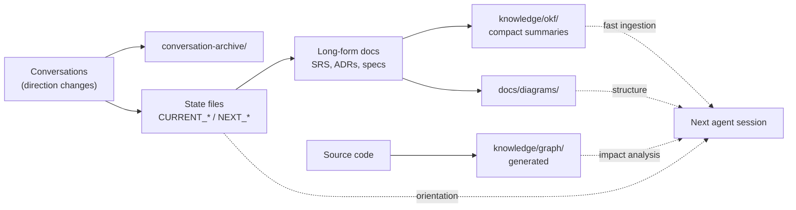

# Knowledge System

## Purpose

The project must survive long timelines, context-window limits, and handoff between many AI agents. The knowledge system turns scattered decisions into durable, searchable project memory.

## Layers

### 1. Human Docs (`docs/`)

Readable planning and governance: purified prompt, discovery, requirements, SRS, architecture, process, ADRs, backlog, bugs/risks, tech debt, QA specs, release checklists. Source of truth.

### 2. Machine Knowledge (`knowledge/okf/`)

Structured, machine-readable Markdown summaries. **One concept per file**, short and explicit, so agents ingest them quickly without reading the long-form docs.

Use entries for: product concepts, requirement summaries, architecture entities, data models, module relationships, decision records, risk and debt summaries.

Areas (create as needed):

```txt
knowledge/okf/product/       knowledge/okf/requirements/
knowledge/okf/architecture/  knowledge/okf/decisions/
knowledge/okf/domain/        knowledge/okf/risks/
knowledge/okf/process/       knowledge/okf/tasks/
```

Entry template (`docs/templates/KNOWLEDGE_ENTRY_TEMPLATE.md`):

```md
---
id:
type:
status:
updated:
source_docs:
related_requirements:
related_adrs:
---

# Title

## Summary

## Relationships

## Open Questions

## Handoff Notes
```

### 3. Vault Navigation (Obsidian-compatible)

Treat the repo as an Obsidian-compatible vault: Markdown everywhere, stable headings, `[[wiki-links]]` where helpful, an index file (`docs/VAULT_INDEX.md` if you adopt it), searchable IDs. The vault view is for thinking and browsing; the repo remains the source of truth.

### 4. Diagrams (`docs/diagrams/`)

Canonical Mermaid pack, one concept per file. Diagrams are source code (see `docs/METHODOLOGY.md`).

### 5. Code Graph (after code exists)

Generate code-relationship graphs (call paths, module coupling, file sizes) with whatever tooling fits your stack; store outputs under `knowledge/graph/`. Uses: connect modules to requirement IDs, detect oversized/over-coupled files, give agents call-path context before edits, support impact analysis before large changes. Regenerate after large refactors. Generated outputs are never the source of truth.

## Knowledge Flow



## Update Rules

- Update OKF entries when requirements, architecture, or process change — in the same burst as the source doc.
- Update links and the index when files are renamed.
- Regenerate code graphs after large refactors.
- If a doc and an OKF entry disagree, fix both and record the correction in `docs/CURRENT_THINKING.md`.
- Schedule a periodic **stale-knowledge sweep** (Scribe role) once construction starts: sample entries, verify against code/docs, fix drift.
