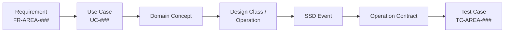

# Software Engineering Methodology — The Artifact Chain

## Purpose

This project uses a classical software-engineering artifact chain, kept deliberately lightweight and Markdown-native so AI agents can produce, consume, and verify it. The chain is what turns "the agent wrote some code" into "the system implements requirement FR-X-012, verified by TC-X-012".

## The Chain

```txt
Inception -> Requirements/SRS -> Process Model -> Use Cases -> Domain Model
-> Data Flow Diagrams -> Design Class Diagram -> System Sequence Diagrams
-> Operation Contracts -> Packages & CRC -> Final Report
```

Artifact skeletons live in `docs/software-engineering/` (numbered 00–09). The diagram sources live in `docs/diagrams/`.

## The Traceability Rule

Every real feature must trace end to end:

```txt
Requirement -> Use Case -> Domain Concept -> Design Class/Operation -> SSD Event -> Operation Contract -> Test Case
```



Coverage is recorded as one row per requirement in `docs/TRACEABILITY_MATRIX.md`. The docs validator flags requirements that appear nowhere in the matrix.

## Why Each Artifact Earns Its Place

| Artifact | What breaks without it (in agentic development) |
|---|---|
| Purified prompt / Inception | Agents optimize for the literal words of a messy prompt |
| Requirement catalogue with IDs | No stable vocabulary; features drift between sessions |
| SRS with out-of-scope list | Agents gold-plate and wander |
| Process model | No agreed loop; every session improvises its own process |
| Use cases | Agents build endpoints, not user goals |
| Domain model | Each session invents slightly different entities and names |
| DFDs | Data-handling and privacy boundaries stay implicit |
| Design class diagram | Module boundaries erode; files balloon |
| SSDs | Cross-component flows only exist in one session's context |
| Operation contracts | Pre/postconditions untestable; "done" is a feeling |
| Packages & CRC | Dependency direction decays into a tangle |
| Traceability matrix | No way to know what a change breaks or what a test protects |

## ID Conventions

- Requirements: `FR-<AREA>-###`, `NFR-<AREA>-###` (e.g. `FR-AUTH-003`)
- Use cases: `UC-###`
- Test cases: `TC-<AREA>-###`
- ADRs: `ADR-###`
- Work packages: `WP-###`; sprint tasks: `S<sprint>-###`
- Technical debt: `TD-###`; risks: `RISK-###`

IDs are never reused after retirement. Areas are short uppercase tokens you define in Phase 1 and list in `docs/REQUIREMENTS.md`.

## Depth Calibration

Not every project needs every artifact at full depth. Calibrate by risk, not by enthusiasm:

- **Always full depth:** requirements catalogue, SRS, ADRs, traceability matrix, test matrix.
- **Full depth for complex domains:** domain model, operation contracts.
- **Sketch depth acceptable for simple flows:** DFDs, SSDs — but every *sensitive* data flow gets a real DFD.
- If you cut an artifact, record the cut and its trigger for reinstatement in `docs/CURRENT_THINKING.md`.

## Diagrams Are Source Code

All diagrams are Mermaid in Markdown, one concept per file, under `docs/diagrams/`. Rendered images are build artifacts, never the source of truth. If a diagram change alters a decision or requirement, update ADRs, the traceability matrix, and state docs in the same burst.
