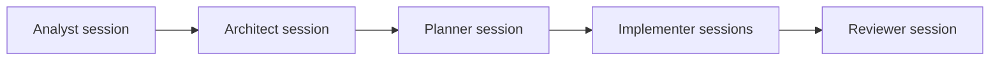
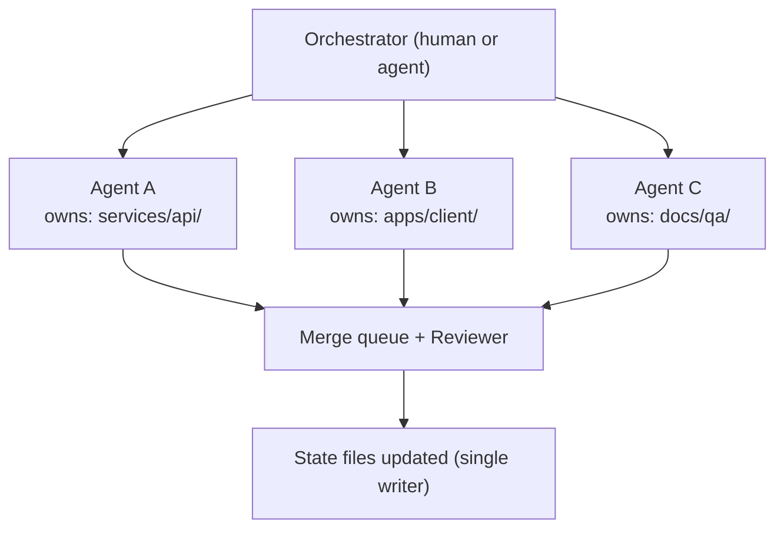

# Multi-Agent Orchestration

How to scale from one agent session to many — roles, topologies, and the rules that keep parallel agents from destroying each other's work. Informed by BMAD's role agents, MetaGPT's SOP-encoded roles, ChatDev's communicative phases, Anthropic's writer/reviewer guidance, and the SE 3.0 command/execution split (see `docs/RESEARCH_FOUNDATIONS.md`).

## Principles

1. **Small agents, one job.** An agent session should hold one bounded task, not the whole project. The repo (not the conversation) is shared memory.
2. **Humans direct, agents execute.** Humans own intent, priorities, and irreversible decisions. Agents own execution and must surface — not absorb — ambiguity.
3. **Structure beats intelligence.** A mediocre model inside this process outperforms a brilliant model freestyling. Design the process, not the prompt.
4. **Pause points are features.** Irreversible or outward-facing actions (deletes, deploys, publishing, spending) require explicit human approval, every time.

## Agent Roles

Roles are hats, not necessarily separate tools — one agent can wear different hats in different sessions, but never two hats in one session (role confusion produces self-approved work).

| Role | Owns | Produces | Must not |
|---|---|---|---|
| **Analyst** | Discovery, research, requirements | Purified prompt, research baseline, requirement catalogue | Make architecture decisions |
| **Architect** | ADRs, system design, boundaries | ADRs, architecture doc, threat model, diagrams | Write feature code |
| **Planner** | Decomposition | Sprint plans, work packets sized to one session | Implement its own packets in the same session |
| **Implementer** | One work packet | Code + tests, commits, state updates | Touch forbidden files; expand scope |
| **Reviewer** | Verification of someone else's diff | Review notes, accepted/rejected verdict, found risks | Fix the code itself (hand findings back) |
| **Tester / QA** | Test specs, goldsets, gate design | Test catalogues, matrices, benchmark reports | Weaken a gate to make it pass |
| **Scribe / Librarian** | Knowledge maintenance | State-file consistency, knowledge entries, stale-doc sweeps | Change requirements while "tidying" |

## Orchestration Patterns (in order of adoption)

### 1. Single agent, role-sequenced (default)

One agent session per role phase. Cheapest, no coordination overhead. Use until throughput genuinely limits you.

### 2. Writer / Reviewer pair

Two agents, adversarial by design. The reviewer gets the packet + diff, not the writer's reasoning, so it cannot inherit the writer's blind spots. Strongest cheap quality upgrade available.

### 3. Planner / Executor split

A high-capability session produces packets; cheaper or parallel sessions execute them. The packet is the API between them — if executors keep needing clarification, fix the packet template, not the executor.

### 4. Parallel implementers with folder ownership

N agents on N packets with **disjoint owned-file sets**. Requirements:

- Ownership declared in every packet; validators may check for overlap.
- Shared state files are updated by one designated agent per window (or serialized at merge time).
- Prefer separate branches/worktrees per agent; merge through the review role.

### 5. Swarm with merge queue (advanced)

Many short-lived agents pull packets from the board; all output flows through a merge queue where reviewer agents + CI gates verify before integration. Only adopt when patterns 1–4 are running smoothly — a swarm amplifies whatever process quality you already have, including bad quality.

## Escalation Rules (agent → human)

An agent must stop and ask when:

- Two accepted documents contradict each other.
- The task requires editing forbidden files.
- Acceptance criteria cannot be met without violating a gate or an ADR.
- A reversal condition of an accepted ADR appears to be triggered.
- Anything irreversible or outward-facing is about to happen.

An agent must **not** ask about things it can resolve from the repo: naming, formatting, established conventions, previously decided questions.

## Model Diversity Note

Different sessions may run different models. That is a feature: reviewer diversity catches writer-model idiosyncrasies. The contract in `AGENTS.md` deliberately depends on no specific tool or vendor.
