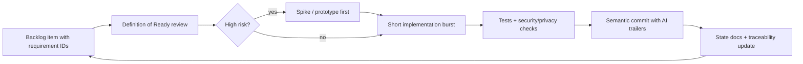

# Project Process — Rules In Force

This is the always-read rulebook. The phase-by-phase playbook lives in `docs/LIFECYCLE_PHASES.md`; the artifact methodology lives in `docs/METHODOLOGY.md`.

## Prime Rule

Before ending meaningful work, update the project state:

1. `docs/CURRENT_TASK.md`
2. `docs/CURRENT_THINKING.md`
3. `docs/NEXT_TASK.md`
4. `docs/BACKLOG.md`
5. `docs/BUGS_AND_RISKS.md`
6. `docs/TECH_DEBT.md`
7. `docs/conversation-archive/` when the conversation changed direction or decisions

This keeps the project portable across humans and AI agents. A project where the state files are stale is a project that has silently stopped being agentic-ready.

## Process Model

Hybrid **Agile-incremental with risk-driven spikes and phase gates**:

- Phases 0–6 build the specification, decisions, and guardrails (thinking made durable).
- Phase 7+ is an incremental construction loop shipping vertical slices.
- Any subsystem may drop into a spiral risk cycle (prototype → evaluate → decide) when it accumulates repeated failures; record the trigger in `docs/CURRENT_THINKING.md`.

The development loop for every backlog item:



## Phase Order

Do not skip phases unless an ADR explains why. Summary (details in `docs/LIFECYCLE_PHASES.md`):

0. Inception & Discovery (purified prompt)
1. Research & Requirements
2. Specification (SRS)
3. Architecture & ADR validation
4. Design artifacts & UX flows / prototype spikes
5. QA & gate design
6. Repo scaffold, toolchain, CI
7. Construction: vertical slice loop (repeat per increment)
8. Hardening (security, performance, benchmarks)
9. Release rings (alpha → beta → production)
10. Operations, feedback, and knowledge maintenance

## Work Package Rules

Every coding task must be a work packet before implementation. Each packet needs:

- Goal
- Requirement IDs
- Owned modules/files
- Non-owned modules/files that must not be edited (forbidden files)
- Acceptance criteria
- Test plan
- Migration plan if data changes
- Security/privacy review notes
- Rollback plan
- Handoff notes

Packet template: `docs/templates/WORK_PACKAGE_TEMPLATE.md`. Packet board: `docs/WORK_PACKAGE_BOARD.md`.

## Short-Burst Commit Rule

Commit in small semantic bursts after each stable mini-milestone. A good commit has one clear reason to exist. Follow `docs/COMMIT_POLICY.md` and `.gitmessage.txt`. AI-authored commits carry attribution trailers. Do not commit broken code unless it is an intentional WIP checkpoint with the recovery path written in `docs/NEXT_TASK.md`.

## Adversarial Thinking Rule

For each major decision, write the best argument against the current plan. A decision is not strong until it survives a serious challenge. Use ADRs (`docs/adr/`) for decisions involving: platform/framework, data store, external providers, core domain algorithms, security/privacy model, deployment, release process, and repo structure.

## File Size And Module Rules

- Target 200–300 lines per source file.
- Split by responsibility before a file becomes hard to test.
- Keep public interfaces small and explicit.
- Avoid cross-module imports that bypass domain boundaries.
- Add local module READMEs when a module becomes non-trivial.
- Prefer many focused tests over one broad test file.

Larger files are allowed only when generated by a tool, required by framework conventions, documented in `docs/TECH_DEBT.md`, and paired with a plan to split later.

## Code Context Comments

Comments preserve context, not syntax. Good comments reference requirement IDs and ADR IDs, explain domain rules, explain why a security check exists, and mark temporary compromises with a debt ID:

```ts
// REQ FR-SCORE-003, ADR-004: captive items save to collection but skip ranked scoring.
```

## Quality Gates

No feature is complete until:

- Requirement IDs are linked.
- Unit tests pass; integration tests pass for changed flows.
- Security and privacy checklist is reviewed.
- Performance risk is considered.
- State docs are updated.
- The next task is written.

Ready/Done definitions and phased CI gates live in `docs/GOVERNANCE_AND_GATES.md`.

## Verification And Evidence Rule

Agents must demonstrate outcomes, not declare them. Paste test/validator output into the session closeout. Every skipped test needs a reason and a follow-up entry. Where practical, a different agent (or a fresh session) reviews the diff — the writer/reviewer pattern catches what the author's context blinds them to.

## AI Agent Handoff Rules

When handing work to another agent: point it to `docs/CURRENT_TASK.md` and `docs/NEXT_TASK.md` first, give owned and forbidden files, ask it to update state docs before its final response, and ask it to list changed files and tests run. Never let two agents edit the same files in parallel. Full protocol: `docs/AGENT_HANDOFF_SYSTEM.md`.

## End Of Task Checklist

- Update current task status.
- Update current thinking with new decisions.
- Add new backlog items, bugs/risks, and technical debt discovered.
- Update next task with the exact next step.
- Run relevant tests or explain why not (with follow-up).
- Summarize changed files and commits.
