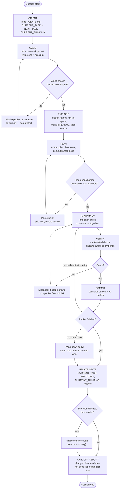

# Agent Session Loop

The inner loop every agent session runs, from orientation to handoff. This is the operational heart of the whole methodology.

**Invariants:**
- Never skip ORIENT, even for "quick" tasks — stale context is how agents undo prior decisions.
- One packet per session; splitting mid-flight is a planning failure to record.
- Every VERIFY produces pasted evidence; every skipped check produces a reason + follow-up.
- The session may end early at any time *if* UPDATE STATE and HANDOFF happen. The only unacceptable ending is a silent one.
