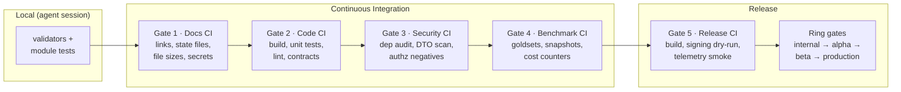
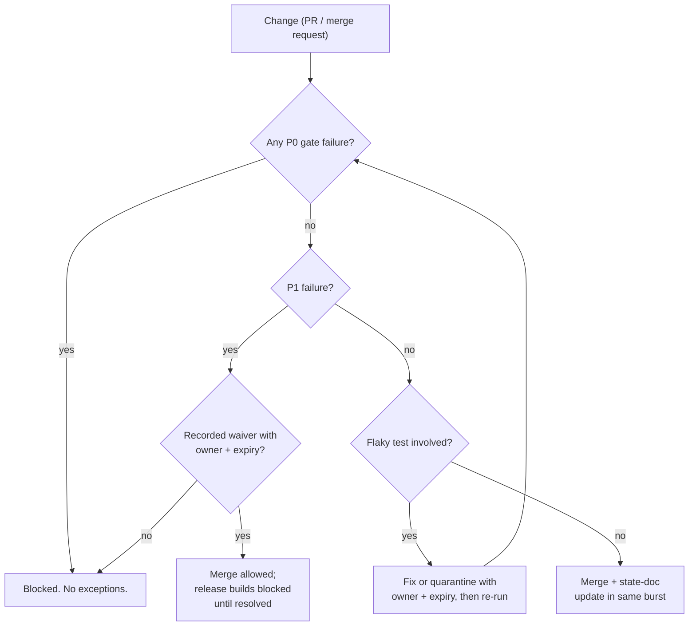

# CI Gate Pipeline

The five-gate ladder from `docs/GOVERNANCE_AND_GATES.md`, and what a change passes through on its way to production.

Gates activate progressively — Gate 1 from day one; each later gate turns on when its prerequisites exist. **Local/CI parity is mandatory:** every CI check has a documented local command, so agents never discover a gate for the first time in CI.

## Merge Decision

