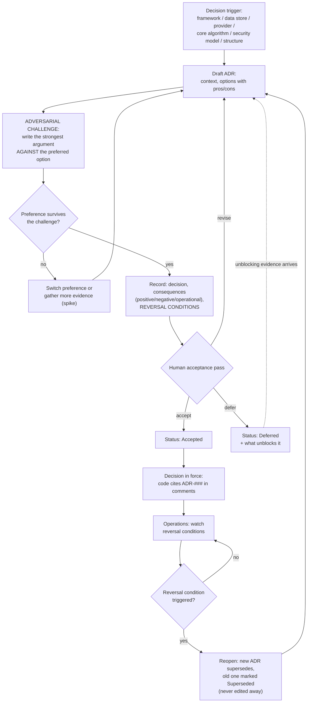

# Decision Workflow (ADR Lifecycle)

Every major decision runs this loop, including the adversarial challenge and the reversal path. Template: `docs/templates/ADR_TEMPLATE.md`.

## Rules

- An ADR without reversal conditions is not acceptable — every decision must state what evidence would reopen it.
- Deferring is legitimate; deferring without an unblock condition is not.
- Superseded ADRs stay in the repo forever: they are the project's institutional memory of *why not*.
- Agents cite ADR IDs in code comments where the decision shapes the implementation.
