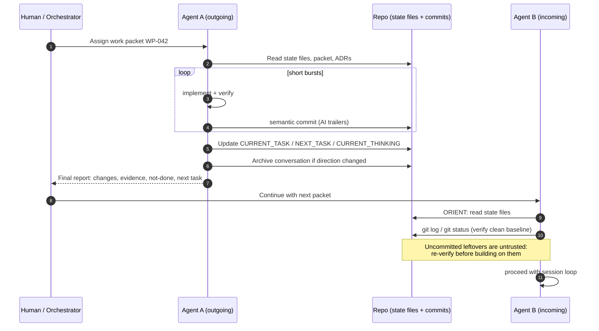
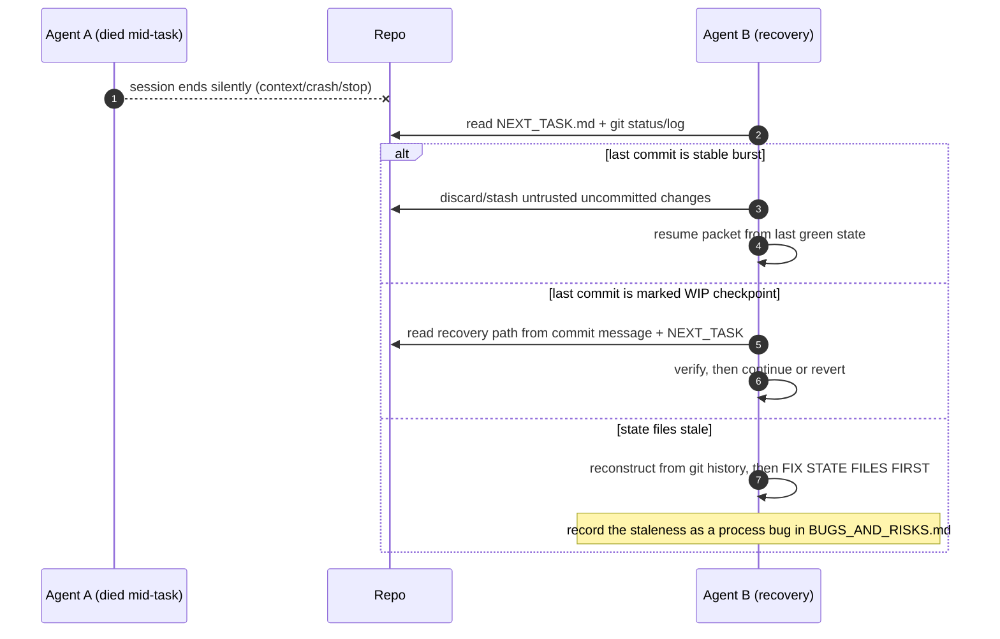

# Handoff Sequence

Agent-to-agent handoff flows through repository state, never through shared conversation. The test of a good handoff: the incoming agent never needs the outgoing agent's chat transcript.

## Failure Path: Interrupted Session

