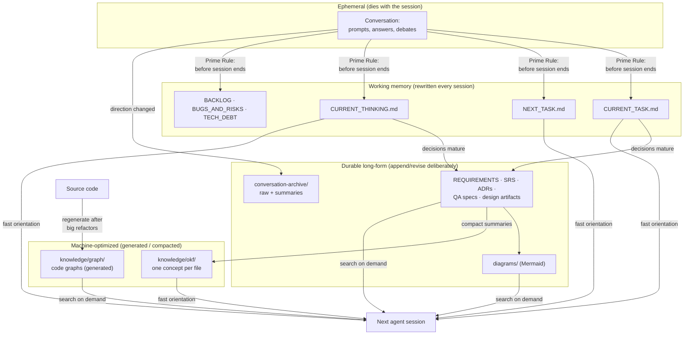

# Knowledge Flow

How knowledge moves from ephemeral conversation into durable, layered project memory — and back into the next agent session. Full rules: `docs/KNOWLEDGE_SYSTEM.md` and `docs/CONTEXT_ENGINEERING.md`.

**The one-way valve:** knowledge only flows *from* conversation *into* files — never the reverse. If a fact lives only in a chat transcript, the process treats it as lost. The Prime Rule (update state before ending work) is the valve's enforcement mechanism.
