# Master Lifecycle

The full phase-gated lifecycle. Diamonds are human-approved gates; no gate may be skipped without an ADR. Details per phase: `docs/LIFECYCLE_PHASES.md`.

```mermaid
flowchart TB
  START(["Rough product idea"]) --> P0["Phase 0<br/>Inception & Discovery<br/>mob elaboration, purified prompt"]
  P0 --> G0{"Purified prompt<br/>accepted?"}
  G0 -- no --> P0
  G0 -- yes --> P1["Phase 1<br/>Research & Requirements<br/>FR/NFR catalogue with IDs"]
  P1 --> G1{"Catalogue reviewed?<br/>IDs + priorities + rings"}
  G1 -- no --> P1
  G1 -- yes --> P2["Phase 2<br/>Specification (SRS)<br/>scope, acceptance, out-of-scope"]
  P2 --> G2{"SRS accepted?"}
  G2 -- no --> P2
  G2 -- yes --> P3["Phase 3<br/>Architecture & ADRs<br/>adversarial challenge, threat model"]
  P3 --> G3{"ADR pack dispositioned?<br/>accept / revise / defer"}
  G3 -- no --> P3
  G3 -- yes --> P4["Phase 4<br/>Design Artifacts & Spikes<br/>use cases, domain, contracts, UX"]
  P4 --> G4{"P0 requirements<br/>fully traced?"}
  G4 -- no --> P4
  G4 -- yes --> P5["Phase 5<br/>QA & Gate Design<br/>test matrix, ready/done, CI plan"]
  P5 --> G5{"Pre-code audit<br/>passes?"}
  G5 -- no --> P5
  G5 -- yes --> P6["Phase 6<br/>Scaffold & Toolchain<br/>skeleton, CI gate 1, sprint packets"]
  P6 --> G6{"Validators green in CI?<br/>Packets Ready?"}
  G6 -- no --> P6
  G6 -- yes --> P7["Phase 7<br/>CONSTRUCTION LOOP<br/>vertical slices via work packets"]

  P7 --> SL{"Slice gate:<br/>acceptance + evidence?"}
  SL -- next slice --> P7
  SL -- release candidate --> P8["Phase 8<br/>Hardening<br/>security, perf, benchmarks"]
  P8 --> G8{"Launch-blocking<br/>areas green?"}
  G8 -- no --> P7
  G8 -- yes --> P9["Phase 9<br/>Release Rings<br/>internal → alpha → beta → prod"]
  P9 --> G9{"Ring evidence<br/>complete?"}
  G9 -- no --> P8
  G9 -- yes --> P10["Phase 10<br/>Operations & Evolution"]
  P10 -->|"new increment"| P7
  P10 -->|"ADR reversal triggered"| P3

  RISK["Spiral escape hatch:<br/>repeated subsystem failures →<br/>prototype → evaluate → ADR"] -.->|"any phase"| P3
```

**Reading the gates:** every `{...}` diamond is a human decision recorded in state files. Phases 0–6 produce durable context; Phase 7+ consumes it. The heavy front matters *because* agents are cheap at producing it and expensive to run without it.
