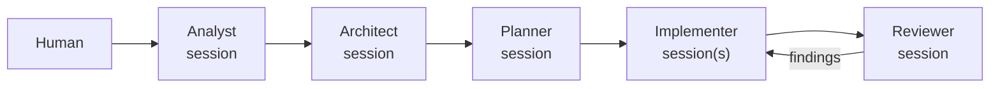
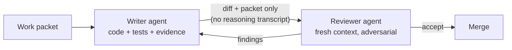
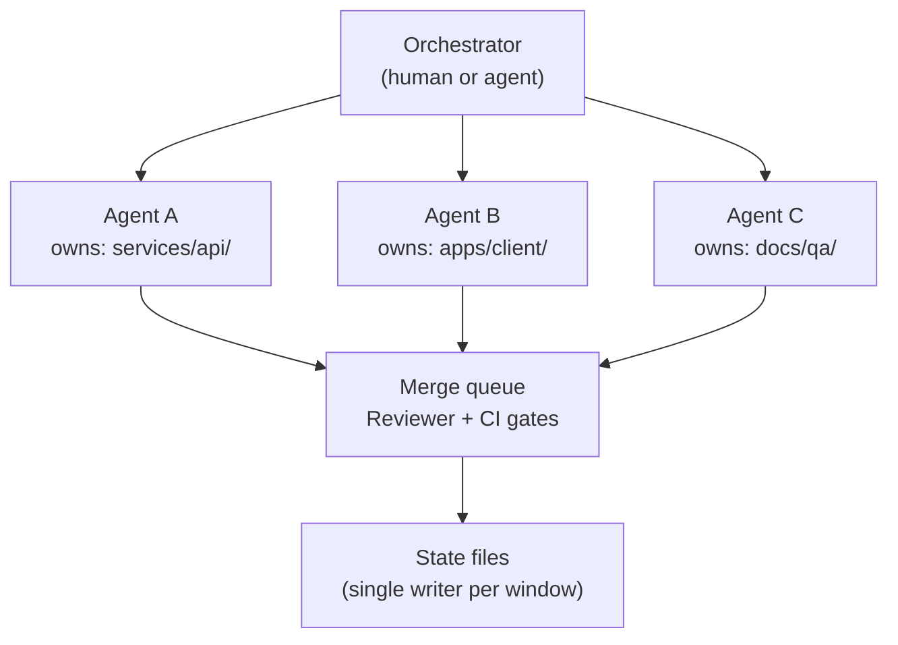
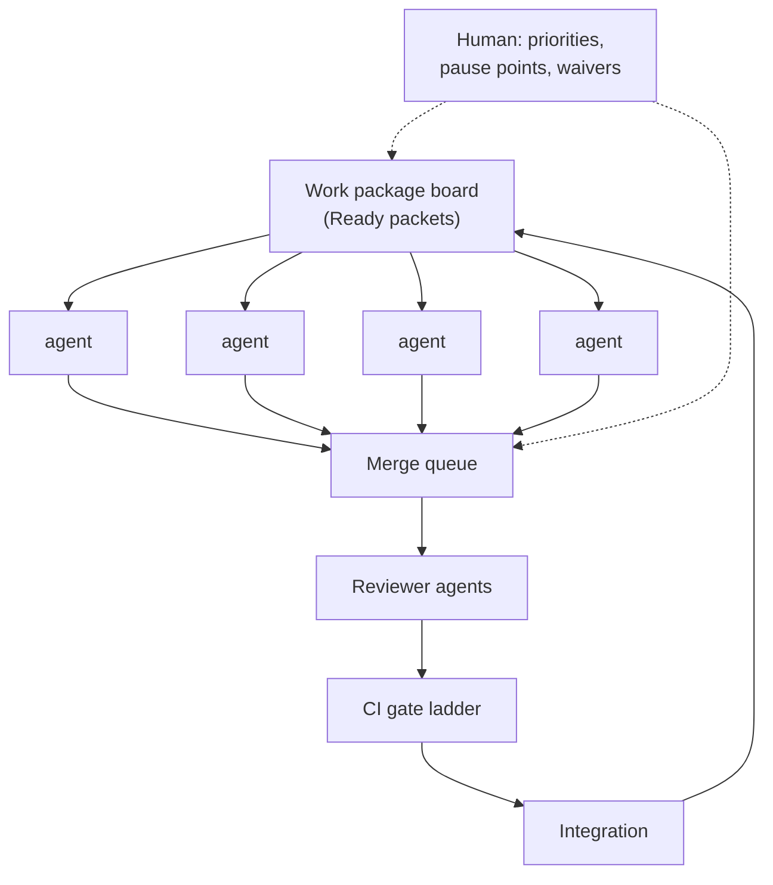

# Orchestration Topologies

The four adoption stages of multi-agent work. Adopt in order; each stage amplifies the process quality of the previous one. Full rules: `docs/MULTI_AGENT_ORCHESTRATION.md`.

## Stage 1 — Single Agent, Role-Sequenced (default)

## Stage 2 — Writer / Reviewer Pair

## Stage 3 — Parallel Implementers, Folder Ownership

## Stage 4 — Swarm With Merge Queue (advanced)

## Choosing A Stage

| Signal | Move to |
|---|---|
| Solo project, phases still early | Stage 1 |
| Defects slipping through self-review | Stage 2 |
| Ready packets queuing faster than one agent clears them | Stage 3 |
| Stages 1–3 running smoothly for multiple slices | Stage 4 (maybe) |

Never jump a stage to feel fast — a swarm running a weak process produces weak output at swarm speed.
