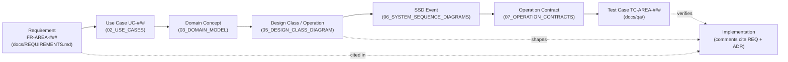
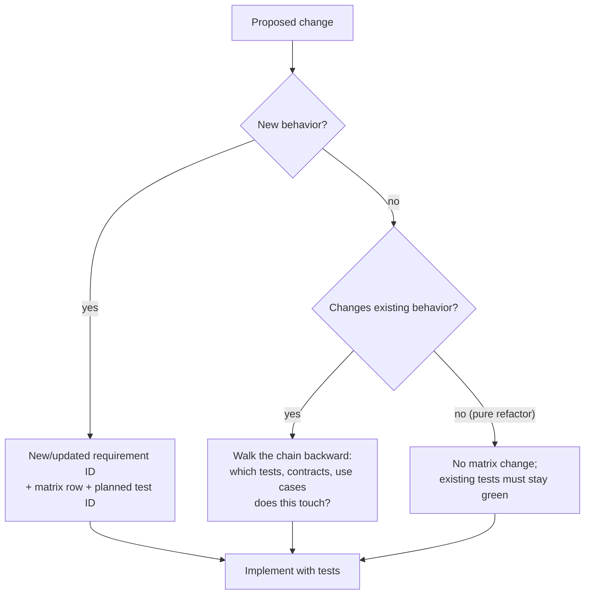

# Traceability Chain

Every feature traces from requirement to test. Coverage is one row per requirement in `docs/TRACEABILITY_MATRIX.md`.

## Change Impact Flows Both Ways

The chain is what lets any agent answer, in seconds: *why does this code exist, and what breaks if I change it?*
