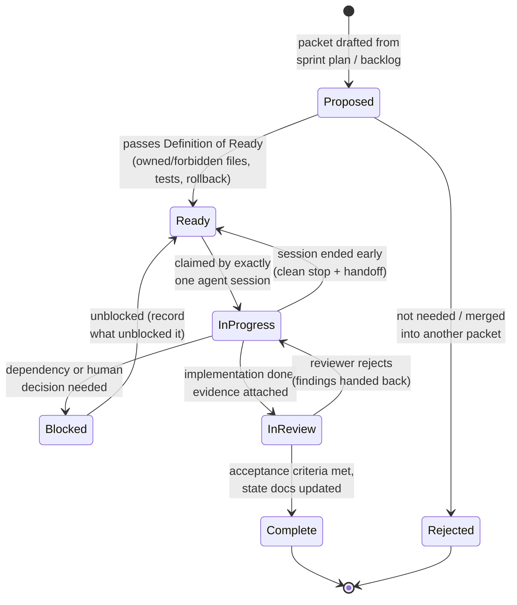

# Work Package Lifecycle

Packet states from proposal to completion. Board: `docs/WORK_PACKAGE_BOARD.md`.

## Rules

- **Ready** is a real gate, not a label — see `docs/GOVERNANCE_AND_GATES.md`.
- **InProgress** implies exactly one owner; two agents on one packet is a process violation.
- **Blocked** packets record what unblocks them; a blocked packet with no unblock condition is a planning bug.
- A packet that returns to Ready twice gets split or re-planned — the packet, not the agent, is at fault.
- **Complete** requires evidence, not assertion.
