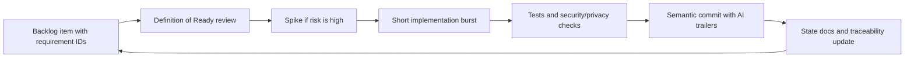

# 01 Software Process Model

## Candidate Survey

<!-- Evaluate honestly against THIS project's risk profile. -->

| Model | Fit for {{PROJECT_NAME}} | Concern |
|---|---|---|
| Waterfall | | |
| Incremental | | |
| Iterative | | |
| Spiral | | |
| Agile/Scrum | | |
| Prototyping | | |

## Selected Model

<!-- Default for this template: hybrid Agile-incremental with risk-driven prototype gates
(see docs/PROCESS.md). Justify or replace for your project. -->

## Development Loop

## Process Rules

- Every story references requirement IDs.
- Every high-risk story has security/privacy review notes.
- Every data-changing story has migration and rollback notes.
- Every algorithm/AI story has benchmark or goldset coverage.
- Every implementation task commits in short semantic bursts.

## Alternative Model And Trigger

Fallback: Spiral for a subsystem. Switch trigger: repeated safety, correctness, cost, or legal failures in one subsystem across two consecutive iterations → pause features there, run identify-risk → prototype → evaluate → decide (ADR) → resume.

## Exit Criteria

- Process model selected and justified; fallback and trigger explicit.
- Process connects to `docs/PROCESS.md`, work packets, traceability, and commits.
