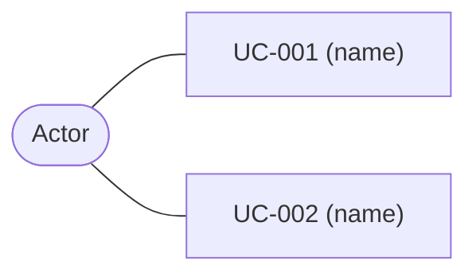

# 02 Use Cases

## Use Case Diagram

## Use Case Index

| ID | Name | Primary Actor | Requirements |
|---|---|---|---|
| UC-001 | | | FR-XXX-### |

## Expanded Use Cases (for essential/high-risk cases)

### UC-001: Name

- **Primary actor:**
- **Preconditions:**
- **Main success scenario:** (numbered steps, actor ↔ system)
- **Extensions/alternates:** (per step)
- **Postconditions:**
- **Related requirements:**

## Exit Criteria

- Every P0 requirement maps to at least one use case.
- Essential use cases are expanded; the rest are indexed.
