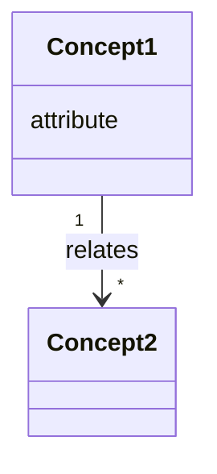

# 03 Domain Model

## Conceptual Class Diagram

## Concept Glossary

<!-- The single source of naming truth. Agents inventing synonyms is a top drift source —
every entity name used in code must appear here first. -->

| Concept | Definition | Key attributes | Related requirements |
|---|---|---|---|
| | | | |

## Invariants

<!-- Domain rules that must always hold (these become operation contract postconditions and tests). -->

-

## Exit Criteria

- Concepts cover every noun in the expanded use cases.
- Glossary names are unique and unambiguous.
- Invariants are listed and traceable to requirements.
