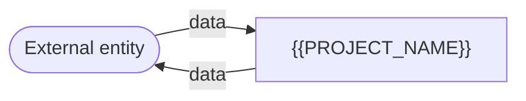
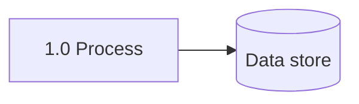

# 04 Data Flow Diagrams

## Level 0 (Context)

## Level 1 (Major Processes)

## Level 2 (Key Flows)

<!-- Mandatory for every flow touching {{SENSITIVE_DATA_CLASSES}}: show exactly where
sensitive data enters, is transformed, is stored, and is exposed. -->

## Hierarchy

| Level | Diagram | Covers requirements |
|---|---|---|
| 0 | context | all |
| 1 | | |

## Exit Criteria

- Level 0 and Level 1 exist.
- Every sensitive data class has a Level 2 flow showing its trust boundaries.
