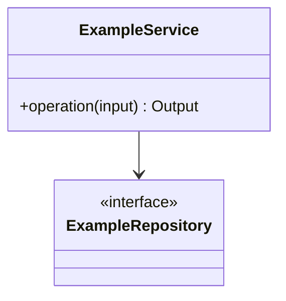

# 05 Design Class Diagram

## Design Classes

## Class Catalogue

| Class | Module | Responsibility | Key operations | Domain concepts |
|---|---|---|---|---|
| | | | | |

## Boundaries And Adapters

<!-- Every external provider sits behind an adapter interface (this is what makes
ADR reversal conditions actionable). List each boundary and its adapter. -->

| External dependency | Adapter interface | ADR |
|---|---|---|
| | | |

## Exit Criteria

- Every domain concept used by a P0 use case has a design home.
- Every external provider is behind an adapter.
- Module boundaries match `08_PACKAGES_CRC.md`.
