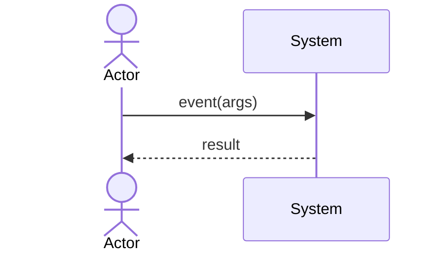

# 06 System Sequence Diagrams

<!-- One SSD per essential use case: actor ↔ system events, system treated as a black box. -->

## SSD: UC-001 (name)

## Event Index

| SSD event | Use case | Operation contract |
|---|---|---|
| event(args) | UC-001 | OC-001 |

## Exit Criteria

- Every essential use case has an SSD.
- Every system event maps to an operation contract in `07_OPERATION_CONTRACTS.md`.
