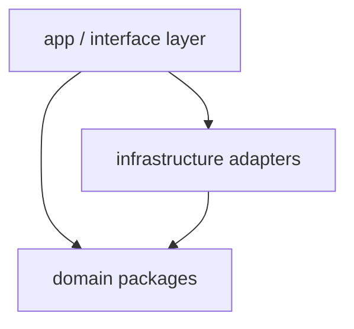

# 08 Packages And CRC

## Package Diagram

<!-- Dependency direction rule: interface → domain ← infrastructure. Domain packages
depend on nothing outward. Violations are architecture-fitness failures. -->

## Package Catalogue

| Package | Responsibility | May depend on | Must not depend on |
|---|---|---|---|
| | | | |

## CRC Cards (key classes)

### ClassName

- **Responsibilities:**
- **Collaborators:**

## Exit Criteria

- Dependency direction is explicit and checkable.
- Every design class belongs to exactly one package.
